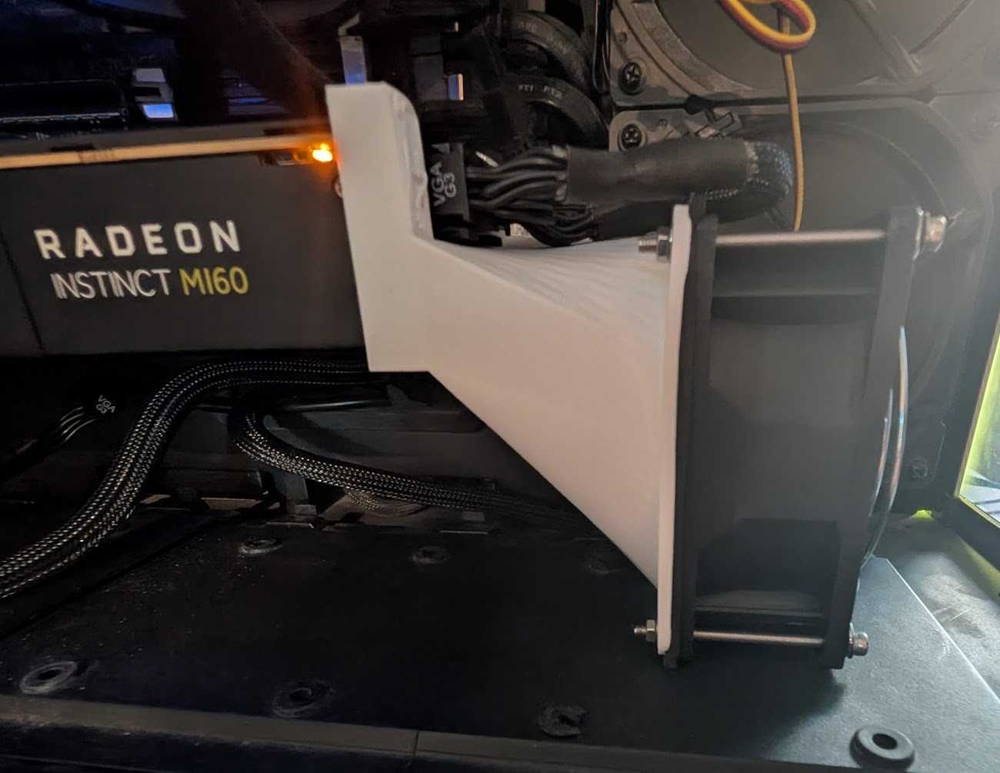

# 🖥️ How to Get an AMD Instinct MI60 Running for AI Workloads

## 1. Introduction

The AMD Instinct MI60 is a powerful server GPU featuring 32 GB of HBM2 VRAM and PCIe 3.0 connectivity. It remains an excellent choice for budget-conscious AI developers looking for high VRAM capacity at a fraction of modern GPU prices. With proper setup, the MI60 can handle local LLM inference, Whisper transcription, Stable Diffusion, and other heavy workloads.

## 🛠 Parts List

| Item                  | Details        | Notes                     |
| --------------------- | -------------- | ------------------------- |
| AMD Instinct MI60 GPU | 32GB HBM2 VRAM | Passive-cooled server GPU |
| **92mm x 38mm Fan**       | High static pressure, 12V, PWM or 3-pin | Example: GDSTIME 92x38mm fan. Needed to force air through MI60's dense heatsink                                         |
| Fan Mounting              | Zip ties, screws, or 3D printed shroud  | A shroud ensures airflow stays directed through the heatsink. [Download STL](https://www.thingiverse.com/thing:6636428) |
| High Wattage PSU          | 600W+ with 2x 8-pin PCIe                | MI60 can draw 300W under AI workloads                                                                                   |

> **Tip**: Look for "**92mm x 38mm high static pressure fan**" on Amazon or eBay. GDSTIME, Delta, and Sunon are common brands. Some models can be loud — use PWM or undervolting to reduce noise.

## 📸 Photos

MI60 with 92mm GDSTIME fan attached using printed shroud. The 3D-printed fan housing also doubles as a physical support 
for the GPU.
 


## 2. Hardware and Compatibility Checklist

### BIOS Settings Checklist

To ensure the MI60 initializes properly and operates with maximum stability, adjust these BIOS settings:

- **Above 4G Decoding**: `Enabled`
  - Required for proper BAR mapping and ROCm support.
- **Resizable BAR**: `Disabled`
  - ROCm does not benefit and may break compatibility with some MI-series cards.
- **PCIe Link Speed**: `Auto` or `Gen 3`
  - The MI60 is a PCIe 3.0 card. Setting Gen 4 may work but is unnecessary.
- **CSM (Compatibility Support Module)**: `Disabled`
  - Use UEFI boot mode for best compatibility with modern Linux distros and ROCm.
- **Integrated Graphics**: `Disabled` (if not needed)
  - Frees up resources and avoids conflicts.
- **Primary GPU**: Set to `PCIe Slot` or `PEG`
  - Ensures the MI60 is initialized at boot.

- **Motherboards**:
  - PCIe 4.0 not strictly required (works well on PCIe 3.0 platforms)
  - Tested platforms: X570, B550, TRX40
- **Power Supply**:
  - Expect \~300W power draw under load
  - Requires two 8-pin PCIe power connectors
- **Cooling Requirements**:
  - Passive GPU (no built-in fan)
  - Requires external fan for reliable cooling
- **Physical Space**:
  - Double-slot width
  - Ensure good airflow around the card

## 3. Software Stack Overview

- **Operating System**: Ubuntu 22.04 LTS or Linux Mint 21.x
- **Driver Stack**: ROCm 5.6 (newer versions dropped MI60 support)
- **AI Frameworks**:
  - PyTorch ROCm build
  - Whisper.cpp (with OpenCL backend)
  - Stable Diffusion (optimized for FP32)
  - Ollama for local LLM inference

## 4. Verifying ROCm Installation

- Check if the GPU is detected:
  ```bash
  rocminfo
  ```
- Verify HIP support:
  ```bash
  /opt/rocm/bin/hipInfo
  ```
- Troubleshooting:
  - Kernel versions 5.15 or 6.2 are recommended.
  - Ensure `/dev/kfd` exists and that your user belongs to the `video` group.
  - Stick to ROCm 5.6 to maintain compatibility.

## 5. Cooling and Fan Control Setup

### Physical Setup

- Mount a 92mm x 38mm fan (e.g., GDSTIME) directly onto the MI60 heatsink.
- Options:
  - 3D printed bracket
  - Zip ties with rubber spacers for vibration isolation
- Connect the fan to:
  - Motherboard CHA\_FAN or SYS\_FAN header
  - Or use an external powered fan hub

### Software Fan Control

You can automate fan behavior using a custom script and systemd service.

#### Example Fan Control Script

Create a script at `/usr/local/bin/mi60-fan.sh`:

```bash
#!/bin/bash
# Adjust this path to your system's PWM control and temperature sensor
FAN_PATH="/sys/class/hwmon/hwmon2/pwm1"
TEMP_PATH="/sys/class/hwmon/hwmon2/temp1_input"

# Temperature thresholds (°C)
MIN_TEMP=35
MAX_TEMP=70

# PWM range: 0-255
MIN_PWM=50
MAX_PWM=255

while true; do
    temp_raw=$(cat "$TEMP_PATH")
    temp_c=$((temp_raw / 1000))

    if (( temp_c <= MIN_TEMP )); then
        pwm=$MIN_PWM
    elif (( temp_c >= MAX_TEMP )); then
        pwm=$MAX_PWM
    else
        pwm=$((MIN_PWM + (MAX_PWM - MIN_PWM) * (temp_c - MIN_TEMP) / (MAX_TEMP - MIN_TEMP)))
    fi

    echo $pwm > "$FAN_PATH"
    sleep 5
done
```

Make it executable:

```bash
sudo chmod +x /usr/local/bin/mi60-fan.sh
```

#### Create a systemd Service

Create `/etc/systemd/system/mi60-fan.service`:

```ini
[Unit]
Description=MI60 Fan Control Service
After=multi-user.target

[Service]
ExecStart=/usr/local/bin/mi60-fan.sh
Restart=always
User=root

[Install]
WantedBy=multi-user.target
```

Enable and start the service:

```bash
sudo systemctl daemon-reexec
sudo systemctl enable --now mi60-fan.service
```

> **Note**: Use `sensors` to identify the correct `hwmon` path for your system and adjust `FAN_PATH` and `TEMP_PATH` accordingly.

1. Install `lm-sensors` and `fancontrol`:

   ```bash
   sudo apt install lm-sensors fancontrol
   ```

2. Detect all available sensors:

   ```bash
   sudo sensors-detect
   ```

   - Answer "yes" to all prompts.

3. View sensor output:

   ```bash
   sensors
   ```

   - Identify the relevant temperature inputs (usually motherboard CPU or system temp).

4. Configure PWM fan control:

   ```bash
   sudo pwmconfig
   ```

   - Follow the prompts to associate PWM outputs with temperature inputs.

5. Enable fancontrol service:

   ```bash
   sudo systemctl enable fancontrol
   sudo systemctl start fancontrol
   ```

> **Tip**: If your motherboard does not expose fine PWM controls, set a BIOS fan curve instead.

## 6. Running AI Workloads

- **Ollama for LLMs**:
  - Run via Docker with GPU device pass-through:
    ```bash
    docker run --rm --device=/dev/kfd --device=/dev/dri -e HSA_OVERRIDE_GFX_VERSION=9.0.6 <image>
    ```
- **Whisper.cpp**:
  - Compile with OpenCL backend and CLBlast for performance.
- **PyTorch ROCm Installation**:
  ```bash
  pip install torch torchvision torchaudio --extra-index-url https://download.pytorch.org/whl/rocm5.6
  ```
- **Stable Diffusion**:
  - Use `--precision full` and `--no-half` flags to avoid issues with FP16 unsupported operations.

## 7. Known Issues and Workarounds

- ROCm 6.x+ drops MI60 support (stick with 5.6).
- Docker containers require manual device mapping.
- MI60 lacks native FP16 acceleration; full precision FP32 models perform better.
- Thermal throttling can occur without adequate cooling.

## 8. Final Notes

- The MI60 is an outstanding choice for affordable local AI compute.
- Proper cooling setup is critical to stable operation.
- With ROCm 5.6, Linux, and some tuning, the MI60 remains highly relevant for demanding AI workloads.

---

Feel free to submit issues or pull requests if you find other optimizations or tips for getting the most out of your MI60!


